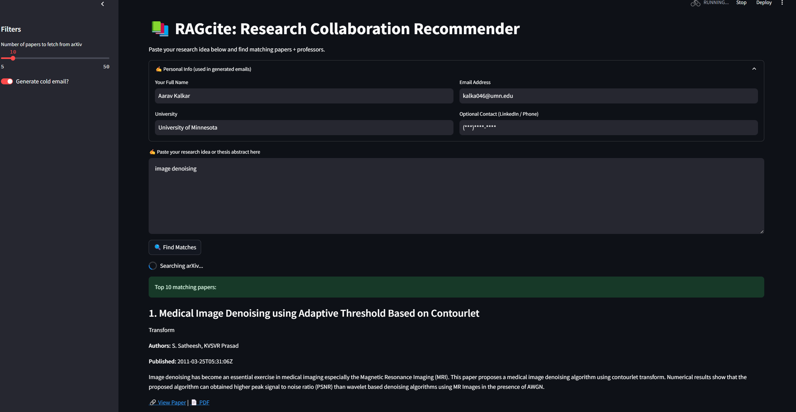

# RAGcite: Research Collaboration Recommender

RAGcite is a personalized research assistant built with Streamlit that helps graduate students discover relevant research papers and contact potential collaborators. It uses arXiv's open API and integrates Retrieval-Augmented Generation (RAG) with DeepSeek V3 to recommend papers and generate cold emails to professors.

---

## 🚀 Features

- **Semantic Paper Search**: Paste your research idea or thesis abstract to find top-matching papers from arXiv.
- **RAG-Powered Recommendations**: Combines sentence embeddings with FAISS to find relevant literature based on meaning, not just keywords.
- **Cold Email Generator**: Uses DeepSeek V3 to create polite, personalized outreach emails to professors or authors.
- **Built-in Personalization**: Automatically includes your name, university, and contact information in generated emails.
- **Customizable Filters**: Choose how many papers to fetch and whether to include emails or not.

---

## 🖼️ Demo

Below is a screenshot of RAGcite in action:




---

## 🛠️ Tech Stack

| Component          | Technology                                   |
|--------------------|----------------------------------------------|
| **UI**             | Streamlit                                    |
| **NLP Embeddings** | Sentence Transformers (`all-MiniLM-L6-v2`)   |
| **Search**         | FAISS Vector DB                              |
| **API Integration**| arXiv API + DeepSeek V3                        |
| **LLM**            | DeepSeek V3 (`deepseek-chat`)                |
| **Backend Logic**  | Python                                       |

---

## 📦 Installation

### 1. Clone the Repo

```bash
git clone https://github.com/aarav2703/RAGcite.git
cd RAGcite
```

### 2. Set Up Environment

```bash
conda create -n ragcite python=3.10
conda activate ragcite
pip install -r requirements.txt
```

### 3. Add Your DeepSeek API Key

Create the `.env` file in the root directory:

```
DEEPSEEK_API_KEY=your_deepseek_api_key_here
```

> Get your  DeepSeek API key from [DeepSeek Platform](https://platform.deepseek.com).-Same key for both Reasoning and V3 models

### 4. Run the App

```bash
streamlit run streamlit_app.py
```

Then open your browser and navigate to:  
[http://localhost:8501](http://localhost:8501)

---

## ✨ Example Use Case

A grad student researching "transformer-based knowledge distillation for low-resource NLP" can:

- Paste their abstract to view 10 semantically similar papers from arXiv.
- Read summaries and visit PDF links.
- Generate personalized cold emails to the first author of each paper.

---

## 📚 File Structure

```
RAGcite/
│
├── streamlit_app.py          # Main Streamlit app
├── requirements.txt
├── .env                      # Stores your DeepSeek API key (not committed)
│
├── arxiv/
│   ├── arxiv_api.py          # arXiv query functions
│   └── parser.py             # XML parsing helpers
│
├── embeddings/
│   ├── deepseek_client.py    # DeepSeek V3 generation client
│   └── vector_store.py       # Embedding + FAISS search
│
└── emails/
    └── email_generator.py    # Cold email generation logic
```


## 🤝 Acknowledgements

- [arXiv.org API](https://arxiv.org/help/api)
- [DeepSeek V3](https://platform.deepseek.com/)
- [Sentence Transformers](https://www.sbert.net/)
- [Streamlit](https://streamlit.io)

---

## 📬 Contact

Made by Aarav Kalkar  
📧 [kalka046@umn.edu](mailto:kalka046@umn.edu)  
🔗 [LinkedIn](https://linkedin.com/in/aaravkalkar)
```


